# Haemodynamic solve — order of execution

Control flow rather than data dependency. Arrows show **what runs next**.
Diamonds are branches, dashed arrows are loop back-edges, and the bracketed labels are the
loop bodies. Equation numbers match `post_radius_assignment_equations.md`.

```mermaid
flowchart TD

  START(["Vessel radii assigned to every edge"])

  subgraph P1["Phase 4 · diameter assignment and provenance guards"]
    L1{{"for each edge in G"}}
    A3["store assigned_diameter_um<br/>from the measured radius"]
    A4["diameter-provenance guards<br/>total failure, then partial fallback"]
    L1 --> A3
    A3 -. "next edge" .-> L1
    L1 --> A4
  end

  VT["graph_to_vtk · writes the mesh and its paths<br/>resistance array refreshed after the solve"]

  RQ["_require_diameters · raise unless every edge<br/>has a positive diameter or default_diameter_um"]

  subgraph P2["Phase 5 · Rheology initialisation"]
    L2{{"for each edge in G"}}
    B1["set hematocrit = 0.45<br/>this is what breaks the circular dependency"]
    B2["E3, E5, E6, E7 → E8 → E10<br/>mu_app from Pries-Secomb"]
    B3["E11 · R = 128 mu_app L / pi D^4<br/>the first resistance any edge carries"]
    L2 --> B1 --> B2 --> B3
    B3 -. "next edge" .-> L2
  end

  IT["iteration = 0"]
  D2{"iteration < 15<br/>and flow change > 1e-4?"}

  subgraph P3["Phase 5 · Rheology iteration body"]
    C1["E12 · build conductance matrix"]
    C2["E13 · build Laplacian"]
    C3["apply Dirichlet pressures<br/>at inlet and outlet nodes"]
    C4["E14 · solve Luu pu = -Luk pk"]
    L3{{"for each edge in G"}}
    C5["E15 · Q_ij = dp / R_ij<br/>record sign, orient into a DAG"]
    C12["compute max flow change<br/>against the previous pass"]
    D5{"iteration > 0 and<br/>flow change ≤ 1e-4?"}
    D6{"DAG sorts topologically?<br/>no cycle in flow directions"}
    C6a["reset every node's inflow totals<br/>node_q_in = 0, node_h_in = 0"]
    C6b["seed each inlet<br/>node_h_in = 0.45, node_q_in = 1.0 as a dummy"]
    L4{{"for each node in topological order"}}
    subgraph C6["C6 · mix incoming haematocrit"]
      D8{"node_q_in > 0?<br/>did any flow arrive"}
      C6c["h_mix = node_h_in / node_q_in<br/>Σ H·Q / Σ Q over incoming edges"]
      C6d["h_mix = 0.45<br/>no inflow, fall back to systemic"]
    end
    D3{"node has exactly<br/>two out-edges?"}
    C7["E16, E17 → E18 → E19 → E20<br/>phase separation split"]
    C8["proportional mixing<br/>relation undefined above a Y-split"]
    C6e["add H·Q and Q of each out-edge<br/>to its child's inflow totals"]
    L5{{"for each edge in G"}}
    C9["recompute E6, E8, E10<br/>from the updated haematocrit"]
    C10["E21 · R = 128 mu_app L / pi D^4<br/>same expression as E11"]
    C11["E22 · tau_w = 32 mu_app Q / pi D^3"]

    C1 --> C2 --> C3 --> C4 --> L3
    L3 --> C5
    C5 -. "next edge" .-> L3
    L3 --> C12 --> D5
    D5 -- no --> D6
    D6 -- yes --> C6a --> C6b --> L4
    L4 --> D8
    D8 -- yes --> C6c --> D3
    D8 -- no --> C6d --> D3
    D3 -- yes --> C7 --> C6e
    D3 -- no --> C8 --> C6e
    C6e -. "next node" .-> L4
    L4 --> L5
    L5 --> C9 --> C10 --> C11
    C11 -. "next edge" .-> L5
  end

  subgraph P4["Phase 5 · Final conductance, effective resistance and flow solve"]
    F1["E23 · build conductance matrix<br/>from the final resistances"]
    F2["E24 · build Laplacian"]
    D4{"do_resistance_calculation<br/>enabled?"}
    F3["E25 · R_eff two-point resistance<br/>reported, not reused"]
    F4["E26 · solve Luu pu = -Luk pk"]
    F5["E27 · Q_ij = dp / R_ij"]
    F6["write flow arrays to VTK and refresh<br/>resistance, hematocrit, viscosity, tau_w<br/>save stop status as field_data"]
    F1 --> F2 --> D4
    D4 -- yes --> F3 --> F4
    D4 -- no --> F4
    F4 --> F5 --> F6
  end

  RS["write rheology_stop_reason, rheology_iterations<br/>and rheology_max_flow_change to G.graph"]
  D7{"stop reason<br/>is converged?"}
  WN["print non-convergence warning"]
  ST["compute_comprehensive_vessel_statistics<br/>betweenness and communities, weighted by the solved resistance<br/>stop status appended to the printed stats"]
  PE["export_per_edge_morphometry to CSV"]

  END(["Pressures, flows and wall shear stress<br/>tagged with the rheology stop reason"])

  START --> L1
  A4 --> VT --> RQ --> L2
  B3 --> IT
  IT --> D2
  D2 -- yes --> C1
  L5 -. "iteration = iteration + 1" .-> D2
  D5 -- "yes, break · converged" --> RS
  D6 -- "no, log a warning and break · flow_cycle" --> RS
  D2 -- "no · max_iterations" --> RS
  RS --> D7
  D7 -- yes --> ST
  D7 -- no --> WN --> ST
  ST --> PE --> F1
  F6 --> END

  classDef deadend fill:#fdf0dc,stroke:#d99b3d,color:#6b4a12;
  classDef loop fill:#eef4ff,stroke:#7c9fd6,color:#24456f;
  class F3 deadend;
  class L1,L2,L3,L4,L5 loop;
```

## Reading the chart

**Blue hexagons** are loop heads. The dashed arrow returning to a hexagon is the next pass of that loop; the solid arrow leaving it is what happens once the loop has finished.

**Three nested loop levels sit inside the rheology iteration.** The outer `while` runs at most 15 times. Within each pass, the graph is walked three separate times — once over edges to compute flow, once over nodes in topological order to split red cells, and once more over edges to update viscosity and resistance.

**The convergence check sits straight after the E15 edge loop.** When `D5` breaks, the
haematocrit split and the E21/E22 update for that pass never run, so the final resistances and
τ_w come from the previous pass. `D2` still ends the loop once 15 passes have run.

**`D6` is the second early exit.** If rounding in the solve leaves a directed cycle,
`topological_sort` raises and the loop breaks with a logged warning. The flows are from this
pass, while the resistances and haematocrit are from the one before.

**Every exit is recorded at `RS`.** Since `09346d7` the solver writes the stop reason
(`converged`, `flow_cycle` or `max_iterations`), the number of pressure solves and the last max
flow change (None if only one pass ran) to `G.graph`. The return value is unchanged. The driver
prints a warning at `WN` for any reason other than `converged`, appends the three values to the
printed statistics, and saves them as `field_data` on the vessels VTK at `F6`.

**An asymmetric Y-split does not converge.** On a single bifurcation with 8 µm and 4 µm
daughters, the 4 µm branch alternates between haematocrit 0 and about 0.246, and its flow
between about 0.6 and 6.3, on successive passes. The swing does not decay, so the loop always
leaves through `D2` on `max_iterations`, and the result is whichever half of the swing pass 15
lands on. A symmetric Y converges on the second pass. Whether the full CB network does is not
yet checked; `rheology_stop_reason` on a real run answers it.

**`C6` reads totals that the parent nodes filled in.** Each node's haematocrit is the
flow-weighted mean of its incoming streams, which is red-cell conservation at a junction. The
node does not look back up its in-edges to find them. Instead, every node, once it has set
haematocrit on its out-edges, adds H·Q and Q to each child's totals at `C6e`. Topological order
guarantees that all parents have done this before the child is reached, which is why `D6` must
pass first. The totals are reset at `C6a` on every pass. At `C6b` the inlets get a dummy inflow
of 1.0 so that their `h_mix` comes out at exactly 0.45; the 1.0 is not a real flow. A non-inlet
node with no inflow, such as one fed only by an edge carrying exactly zero flow, falls back to
0.45 at `C6d`. At an outlet `h_mix` is computed and then unused, since there is no out-edge to
carry it.

**The branch at `D3`** is the only place the phase separation relation is applied. A node with three or more outgoing edges falls to proportional mixing instead, because the Pries relation is defined only for a single bifurcation.

**One node is amber.** `F3`, the two-point effective resistance, is computed and never
read again — though since `69dbe70` it runs after the solve, so the number it reports is a
resistance in physical units.

**E1 and E2 are absent from this chart, deliberately.** The step still called here is
`set_poiseuille_resistances`, but since `aecc53d` the driver passes `assign_resistance=False`,
so the power-law viscosity and the resistance built from it are never computed on this path.
Drawing them would suggest the solve depends on something it does not.

They remain in `post_radius_assignment_equations.md` as E1 and E2, and in the dependency
chart, because the capability is still in the function and the two `resistance_network_pipeline`
drivers rely on it — neither has a rheology stage, so that power-law value is the only
resistance they ever have.

What the step does do here is write `assigned_diameter_um`, which `B2` reads for calibre, and
run the guards below. The diameter comes from the measured radius.

`A4` is two guards, and until `fb73fba` it was only one.
`_raise_if_measurement_mode_measured_nothing` is whole-graph: it fires only when **no** edge
was measured. `check_diameter_provenance` catches the partial case — most edges measured, a
few taking the synthetic branch-order diameter — which the first cannot see. That second
guard existed and was tested, but was called only from
`set_poiseuille_resistances_with_constrictions`, which is unreachable, so it ran nowhere in
production and `MAX_SYNTHETIC_FRACTION_EDT = 0.0` bounded nothing. Both now run here.

**`ST` and `PE` moved after the solve in `8634298`.** The statistics weight betweenness and
community detection by the edge resistance, so running them first weighted them by the power
law. Per-edge morphometry is purely geometric and was unaffected; it moved only to keep the
reported block contiguous.

**`RQ` refuses a missing diameter before `B2` reads one.** Until `f92a96c` an edge reaching
the initialisation with no `assigned_diameter_um` was given 5 µm without warning, and
resistance goes as the inverse fourth power of it. `_require_diameters` now runs first and
raises unless every edge has a positive diameter, or the caller passes `default_diameter_um`,
which `B2` and `C9` then use. The case is reachable via an edge that `set_poiseuille_resistances`
skipped for having no `branch_order`, which the provenance guards cannot see; on this data
branch ordering reached all 8242 edges, so it has not fired.

**`E21` carries the same expression as `E11`.** That is the point of the fix in `7ea1b36`.
The update used to be `R = R_original x mu_app / mu_old`, which double-applied viscosity and
inflated every resistance by 200-540x. Initialisation and update now agree, which is the
property the old form was hiding.
