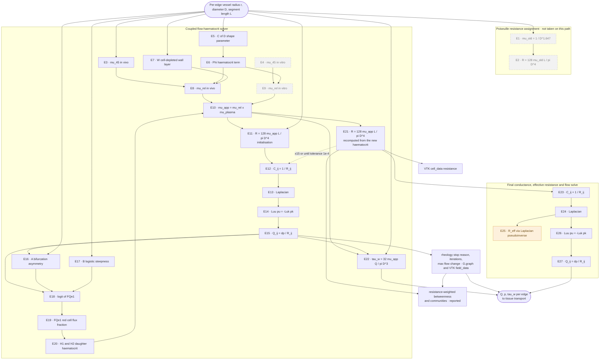
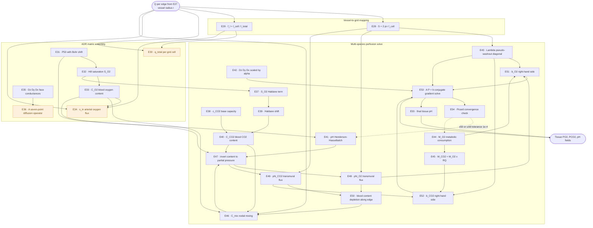

# Equation dependency flow after vessel radius assignment

Arrows show **data dependency**: an arrow from X to Y means Y consumes a quantity X produced.
Dashed back-edges are iteration loops. Node numbering matches `post_radius_assignment_equations.md`.

Split into two charts at the 1D-to-3D handover, since all 55 equations in one chart render far too wide to read.

Legend:

- **Grey dashed outline** — available but not executed in the default configuration.
- **Amber fill** — computed, but its result is not consumed by anything downstream.

---

## Chart 1 — Network haemodynamics (E1 to E27)

---

## Chart 2 — Tissue transport (E28 to E55)

## Notes on the amber nodes

**E25** — the two-point effective resistance is reported and never used again. Since the
fix in `69dbe70` it is at least computed from the converged Pries-Secomb resistances, so the
number is now a resistance in physical units; it is simply not consumed by anything.

**E1 and E2 are no longer executed on this path.** The carotid body driver passes
`assign_resistance=False` since `aecc53d`, so the power-law viscosity and the resistance
built from it are never computed. They stay in the list, and in the chart, because the
capability remains in `set_poiseuille_resistances` and the two `resistance_network_pipeline`
drivers still use it — those have no rheology stage at all, so it is the only resistance they
have. Same status as `E4` and `E9`, the in vitro relations: available, not taken here.

`set_poiseuille_resistances` is still called on the carotid body path, for
`assigned_diameter_um` and the diameter-provenance guard. Both come from the measured
radius.

**E30, E34, E36** — `build_adr_matrix` is called unconditionally and produces `q_total`,
`s_incoming` and the diffusion operator, but `solve_multi_species_perfusion` does not receive
them and builds its own matrices via E42. They are computed and discarded in the default
configuration.

## Notes on the two loops

**E21 back to E12** — the rheology solver. Each pass recomputes viscosity from the updated
haematocrit, rebuilds the Laplacian, re-solves for pressure and re-splits red cells at every
bifurcation. Runs up to 15 times. `STOP` records why it ended — `converged`, `flow_cycle` or
`max_iterations` — from the pass-to-pass change in the `E15` flows, and travels with the
statistics and the output (`09346d7`). An asymmetric Y-split never converges: its smaller
daughter's haematocrit alternates between two values on successive passes, so the loop ends on
`max_iterations`.

**E54 back to E41 and E44** — the Picard loop. Each pass recomputes pH and metabolic rate
from the updated tissue partial pressures, re-walks the vessel tree, and re-solves both
diffusion systems. Runs up to 50 times.

## What changed in `7ea1b36` and `69dbe70`

**The resistance rescale is gone.** The in-loop update was
`R = R_original x mu_app / mu_old`, which double-applied viscosity and inflated every
resistance by 200-540x. It is now a direct Poiseuille recompute, which is why `E21` carries
the same expression as `E11`. The old `E24` no longer exists and everything after it has
shifted down by two.

**The VTK resistance array is refreshed after the solve.** `graph_to_vtk` still runs
early, because the visualiser and the flow solve both need its paths, but the post-solve pass
now rewrites `resistance` alongside `hematocrit`, `viscosity` and `wall_shear_stress_pa`. The
exported mesh no longer carries a resistance and a viscosity from two different models.

**The vessel statistics moved after the solve.** `compute_comprehensive_vessel_statistics`
weights betweenness and community detection by the edge resistance, and ran before the
solver. `STATS` now hangs off `E21`. The effect on the numbers is small — both statistics use
only relative weights, and the two models rank edges similarly — so this corrected the
provenance rather than the values.

**The two-point resistance moved after the solve.** It used to sit in its own block before
the rheology solver, computed from the `E2` power-law resistances. It is now `E25`, inside
the final block, computed from the converged ones. The separate pre-solve conductance and
Laplacian went with it, so the graph is assembled once rather than twice.
