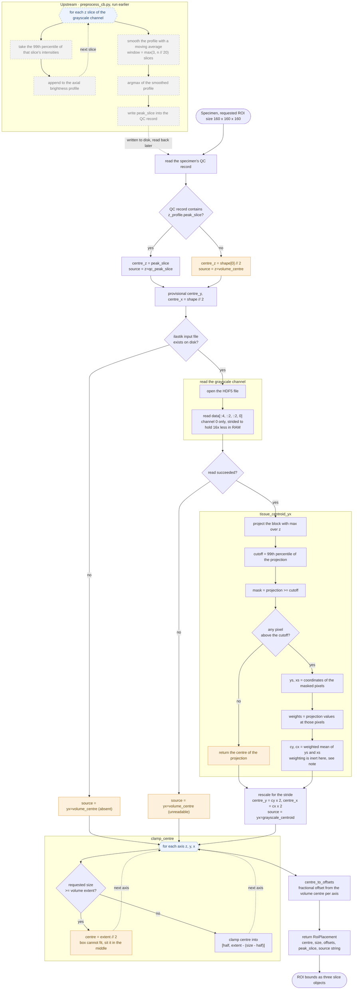

# ROI placement / selection — order of execution

Control flow rather than data dependency. Arrows show **what runs next**.
Blue hexagons are loop heads, diamonds are branches, dashed outlines are fallback paths.

Source: `src/ImageLynx/roi_placement.py`, function `place_roi`.

Note the boundary. The axial peak slice is **not** computed here — it is read from the QC
record written earlier by `preprocess_cb.py`. That upstream derivation is shown in the grey
block for completeness, but it does not run at ROI placement time.

## Reading the chart

**Three independent fallbacks are amber.** Each one substitutes the geometric volume centre
for a measured position, and each records why in the `source` string rather than failing
silently — a silent fallback would reintroduce the centring bias the function exists to
remove. On the six carotid body specimens none of them fire.

**The z and y/x centres are decided independently.** The axial position comes from a QC
record written upstream; the lateral position is measured here from the image. Either can
fall back without the other doing so, which is why `source` is a comma-joined list rather
than a single label.

**The stride is applied before the centroid and undone after it.** `data[::4, ::2, ::2, 0]`
is read, the centroid is computed in strided coordinates, then `cy` and `cx` are multiplied
by 2 to return to full resolution. The z stride of 4 does not need undoing because z is not
used by the centroid — only the max projection over it.

**`C8` is labelled inert.** The upstream preprocessing clips the top 0.02% of voxels to 1.0
and the projection takes a max over z, so 1.33–1.52% of the projection is saturated. The
99th percentile therefore lands exactly on 1.0, every surviving pixel carries the same
weight, and the weighted centroid equals the unweighted one to 0.00 px on all six volumes.
The weighting is kept for inputs that are not saturated at the cutoff.

**`clamp_centre` runs last and can move the centre.** It pulls the box inwards until it fits
wholly inside the volume, because a box hanging over the edge would be silently truncated —
making that sample smaller than the others, which is the thing a matched ROI size exists to
prevent.
